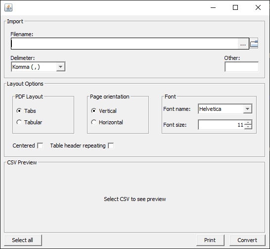

# CSV2PDF
[](https://deepwiki.com/CemTbi/CSV2PDF)

CSV2PDF is a desktop application built with Java Swing that allows users to convert CSV (Comma-Separated Values) files into formatted PDF documents. It provides a graphical user interface to load CSV files, preview their content, and customize the layout of the output PDF.

## Features

- **CSV Import**: Load CSV files using a file chooser or by dragging and dropping them onto the application window.
- **Data Preview**: View the contents of the loaded CSV file in a table, with the ability to select or deselect specific rows for conversion.
- **Customizable Delimiter**: Supports common delimiters (comma, semicolon, tab, space) and allows for custom user-defined delimiters.
- **Flexible PDF Layouts**:
    - **Tabs**: A simple text layout where columns are separated by space, resembling tabs.
    - **Tabular**: A grid-based layout with visible cell borders for a classic table look.
- **Page & Font Customization**:
    - Choose between **Vertical (Portrait)** and **Horizontal (Landscape)** page orientations.
    - Select from various fonts (Helvetica, Times Roman, Courier) and font styles (Bold).
    - Adjust the font size to fit your needs.
- **Layout Adjustments**:
    - Center the table on the PDF page.
    - Repeat table headers on each new page for better readability in multi-page documents.
- **Direct PDF Generation and Printing**:
    - Convert and save the customized table as a PDF file.
    - Print the generated PDF directly from the application.
  
**Preview:**



## Getting Started

### Prerequisites

- Java Development Kit (JDK 17 or later)
- Apache Maven

### Installation and Running

1.  **Clone the repository:**
    ```sh
    git clone https://github.com/cemtbi/csv2pdf.git
    ```

2.  **Navigate to the project directory:**
    ```sh
    cd csv2pdf
    ```

3.  **Compile and run the application using Maven:**
    ```sh
    mvn compile exec:java -Dexec.mainClass="com.ct.csv2pdf.GUI"
    ```

## How to Use

1.  **Launch the application** using the instructions above.
2.  **Import a CSV file** by clicking the **`...`** button next to the filename field or by dragging and dropping a `.csv` file onto the application window.
3.  **Preview Data**: Once a file is loaded, a preview will appear in the "CSV Preview" section.
4.  **Set the Delimiter**: Choose the correct delimiter for your file from the "Delimeter" dropdown. If your delimiter is not listed, select "Other" and enter it in the text field. The preview table will update accordingly.
5.  **Select Rows**: By default, all data rows are selected for conversion. Uncheck the boxes in the first column of the preview table to exclude specific rows from the PDF. Use the **`Select all`** button to toggle the selection for all rows.
6.  **Configure Layout Options**:
    - **PDF Layout**: Choose between `Tabs` (no borders) and `Tabular` (with borders).
    - **Page orientation**: Select `Vertical` or `Horizontal`.
    - **Font**: Set the desired font name and size.
    - **Checkboxes**: Enable `Centered` to center the content horizontally or `Table header repeating` to repeat headers on every new page.
7.  **Generate PDF**:
    - Click **`Convert`** to open a file dialog and save the output as a PDF.
    - Click **`Print`** to open the system's print dialog and print the generated PDF directly.

## Dependencies

This project relies on the following external libraries:

- **[Apache PDFBox](https://pdfbox.apache.org/)**: For creating and manipulating PDF documents.
- **[OpenCSV](https://opencsv.sourceforge.net/)**: For parsing and reading CSV files.

## License

This project is licensed under the MIT License. See the [LICENSE.md](LICENSE.md) file for details.
